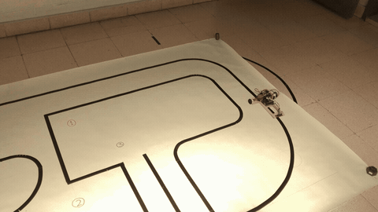
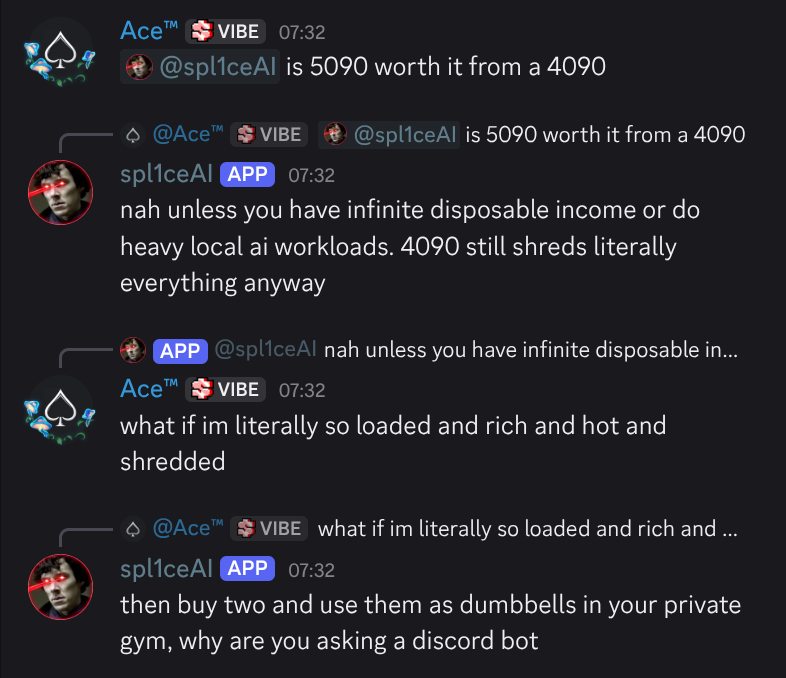

### Hey, I'm spl1ce0 👋

🎓 Studying **Computer Engineering** at **NOVA University Lisbon** 🇵🇹  
🚀 Fascinated by **rockets & space exploration**  
📷 Passionate about **photography**  

*(i use arch btw)*

---

### 🛠️ Some Projects

#### Line Follower Robot

<table>
  <tr>
    <td width="50%" valign="middle">
      
A line follower robot built from scratch!

      <ul>
        <li><b>Sensors:</b> 8-channel reflective IR array (QTR-8RC)</li>
        <li><b>Control:</b> Hand-tuned PID feedback loop</li>
        <li><b>Drive:</b> Dual DC motors with L298N PWM</li>
      </ul>
      
👉 <a href="https://github.com/spl1ce0/Line-Follower-Robot"><b>Source code ↗</b></a>

    </td>
    <td width="50%" align="center">
      
    </td>
  </tr>
</table>

 

#### spl1ceAI

<table>
  <tr>
    <td width="50%" valign="middle">
      
A self-hostable Discord bot with innovative features.

      <ul>
        <li><b>Conversational AI:</b> Fast, contextual chat with real-time knowledge</li>
        <li><b>Multimodal:</b> Understands images, screenshots, and code files</li>
        <li><b>Minigames:</b> Blackjack and Connect 4 with an AI opponent</li>
      </ul>
      
👉 <a href="https://spl1ceai.com"><b>Website ↗</b></a>

      
👉 <a href="https://github.com/spl1ce0/spl1ceAI"><b>Source code ↗</b></a>

    </td>
    <td width="50%" align="center">
      
    </td>
  </tr>
</table>